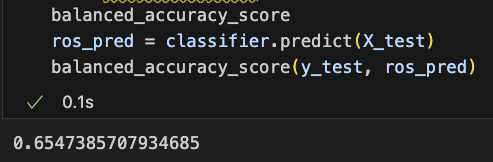

# Credit_Risk_Analysis

## Overview

---

The purpose of the exercise was to find a Supervised Machine Learning alogrithm that would most accurately predict risk factors involved in lending money. Using a variety of machine learning techniques, models were fitted and tested, with accuracy scores and Classification Reports printed out for each. 

---

# Results

---

### Random Oversampler

---

  

### SMOTE

---

  

### Cluster Centroid

---

### SMOTEENN

---

    Unfortunately, all tests run up to this point were fairly disappointing for this specific dataset. The models used so far had not produced much confidence with such a one-sided dataset, and the results of a truly successful model were yet to be found.

### Balanced Random Forest

---

    The Balanced Random Forest model was quite a better predictor than previous models. At 78 percent accuracy, and and 87% Recall of the Low-Risk predictor, we were on the right track.

### Easy Ensemble

---

At last, a truly successful model was found. With a phenomenal confidence level of 93%, only 8 False Positives, the Easy Ensemble model was the best preditor for this dataset.

---
## Summary

---

After testing several models, the Easy Ensemble model was found to be the best predictor for this dataset. With so much risk involved for both the financial institution, as well as the customer, further testing would be necessary, but finding the Easy Ensemble model to be so accurate would be a phenomenal starting point.